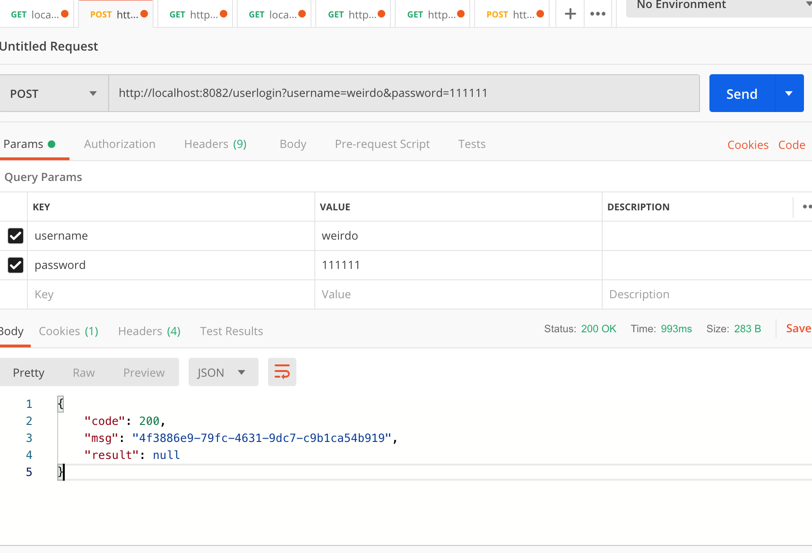
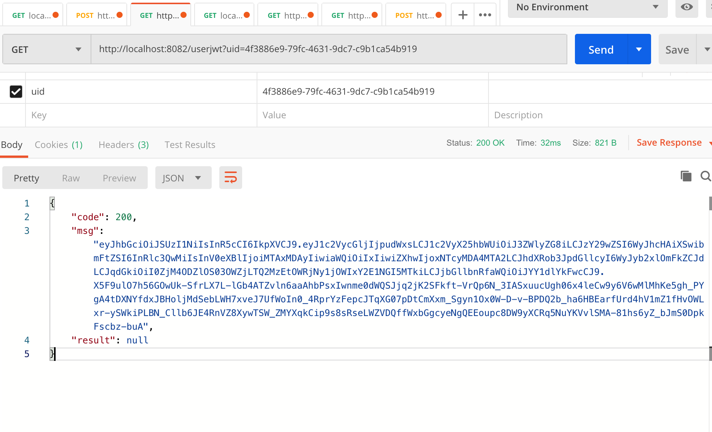
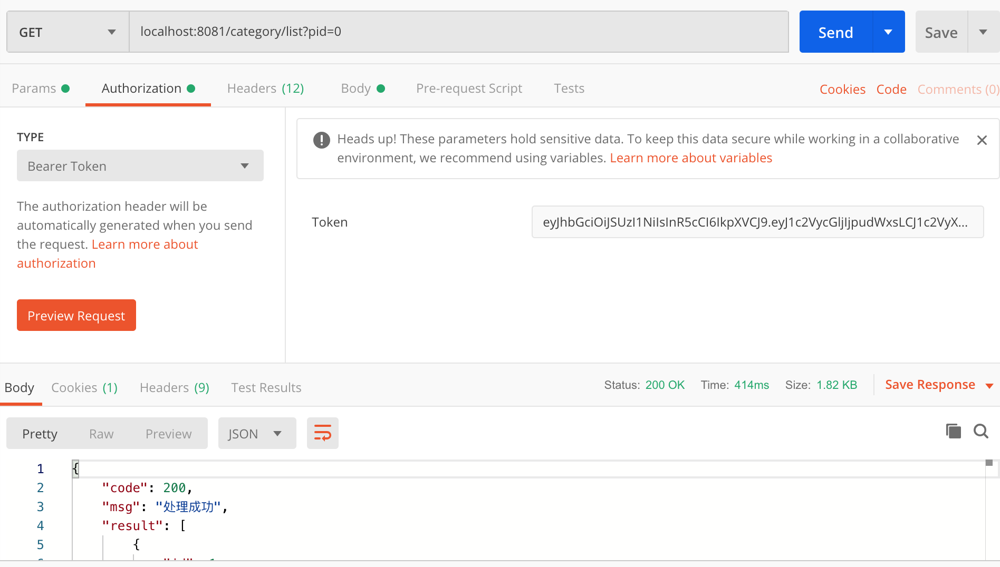

# Getting Started

##一、模块说明
-------------
* 使用技术: SpringCloud全家桶、Elasticsearch、Redis、TkMapper、RabbitMQ、Swagger、Oauth2、OSS文件存储、阿里短信、微信支付宝支付
1. ha-common:公共类
2. ha-config:公共配置文件服务
3. ha-registry:注册中心服务
4. ha-gateway:网关服务
5. ha-pay:支付服务
6. ha-goods:商品服务
7. ha-user:用户管理服务
8. ha-auth:授权服务
9. ha-file: 文件服务
10. ha-sms: 短信服务
11. ha-search: 搜索服务
12. ha-page: 页面服务

##二、服务端口占用
-------------

* 服务名          端口
  
* ha-gateway            10010
* ha-registry           10086
* ha-config             8769
* ha-goods              8081
* ha-auth               8082
* ha-pay                8083
* ha-user               8084
* ha-file               8085
* ha-sms                8086
* ha-search             8087
* ha-page               8088

##三、权限控制
* 权限调试：首先启动redis->注册中心服务(ha-registry)->配置中心服务(ha-config)->权限服务(ha-auth)->用户服务(ha-user)->商品服务(ha-goods)

* 登录：http://localhost:8082/userlogin?username=weirdo&password=111111

* 查询长令牌： http://localhost:8082/userjwt?uid=4f3886e9-79fc-4631-9dc7-c9b1ca54b919

* 调用商品服务：http://localhost:8081/category/list?pid=0(请求头里面需要加长令牌：type:Bearer Token  )

